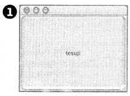
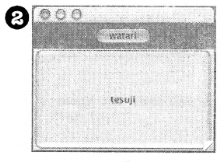
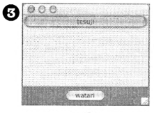
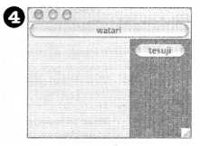
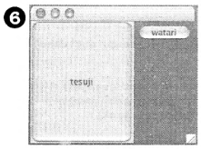

    /* C */
    JFrame frame = new JFrame();
    JPanel panel = new JPanel();
    panel.setBackground(Color.darkGray);
    JButton button = new JButton("tesuji");
    JButton buttonTwo = new JButton("watari");
    panel.add(buttonTwo);
    frame.getContentPane().add(BorderLayout.CENTER, button):
----

    /* D */
    JFrame frame = new JFrame();
    JPanel panel = new JPanel();
    panel.setBackground(Color.darkGray);
    JButton button = new JButton("tesuji");
    JButton buttonTwo = new JButton("watari");
    panel.add(button);
    frame.getContentPane().add(BorderLayout.NORTH, buttonTwo):
    frame.getContentPane().add(BorderLayout.EAST, panel):
----

    /* E */
    JFrame frame = new JFrame();
    JPanel panel = new JPanel();
    panel.setBackground(Color.darkGray);
    JButton button = new JButton("tesuji");
    JButton buttonTwo = new JButton("watari");
    frame.getContentPane().add(BorderLayout.SOUTH, panel):
    panel.add(buttonTwo);
    frame.getContentPane().add(BorderLayout.NORTH, button):
----

    /* A */
    JFrame frame = new JFrame();
    JPanel panel = new JPanel();
    panel.setBackground(Color.darkGray);
    JButton button = new JButton("tesuji");
    JButton buttonTwo = new JButton("watari");
    frame.getContentPane().add(BorderLayout.NORTH, panel):
    panel.add(buttonTwo);
    frame.getContentPane().add(BorderLayout.CENTER, button):
----

    /* B */
    JFrame frame = new JFrame();
    JPanel panel = new JPanel();
    panel.setBackground(Color.darkGray);
    JButton button = new JButton("tesuji");
    JButton buttonTwo = new JButton("watari");
    panel.add(buttonTwo);
    frame.getContentPane().add(BorderLayout.CENTER, button):
    frame.getContentPane().add(BorderLayout.EAST, panel):