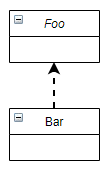
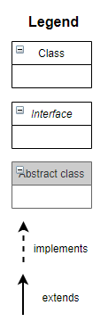

**UML diagram designer**

You need to draw a simple UML diagram that corresponds the given declaration of classes and interfaces.
Follow the given Legend. We made the first one for you.

    public interface Foo { }
    public class Bar implements Foo { }

    public interface Vinn { }
    
    public abstract class Vout implements Vinn { }
<!-- -->
    public abstract class Muffle implements Whuffie { }
    
    public class Fluffie extends Muffie { }
    
    public interface Whuffie { }
<!-- -->
    public class Zoop { }
    
    public class Boop extends Zoop { }
    
    public class Goop extends Boop { }
<!-- -->
    public class Gamma extends Delta implements Epsilin { }
    
    public interface Epsilon { }
    
    public interface Beta { }
    
    public class Alpha extends Gamma implements Beta { }
    
    public class Delta { }   

**Legend**

