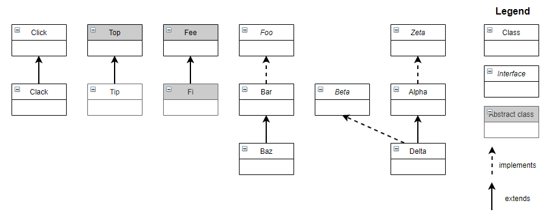

**UML diagram designer**

You are given the UML diagrams of class inheritance.
Make correct Java code corresponding to them.
The first one is already done.

    public class Click { }
    
    public class Clack extends Click { } 